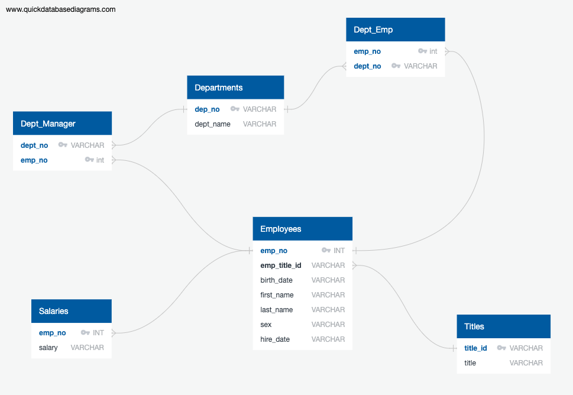

# Employee Database: A Mystery in Two Parts

## The Challenge
This project uses data engineering and data modeling to build a SQL database of employees of a corporation called Pewlett Hackard from the 1980s through the 1990s. Employee data was previously contained within six CSV files. 

### Data Engineering
After inspecting the CSV files, an ERD of the tables was created using the QuickDBD website. 

Using this ERD, table schemas were created for each of the six CSV files. The CSV files were then imported into the corresponding SQL tables.

### Data Analysis
The following data analysis was performed:

List the following details of each employee: employee number, last name, first name, sex, and salary.

List first name, last name, and hire date for employees who were hired in 1986.

List the manager of each department with the following information: department number, department name, the manager's employee number, last name, first name.

List the department of each employee with the following information: employee number, last name, first name, and department name.

List first name, last name, and sex for employees whose first name is "Hercules" and last names begin with "B".

List all employees in the Sales department, including their employee number, last name, first name, and department name.

List all employees in the Sales and Development departments, including their employee number, last name, first name, and department name.

In descending order, list the frequency count of employee last names, i.e., how many employees share each last name.
